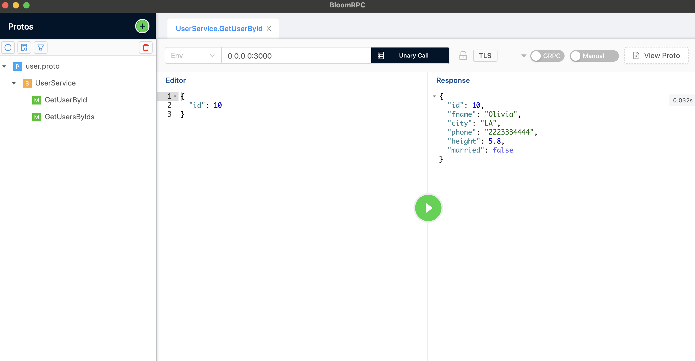

# gRPC Service

This project implements a gRPC service that simulates a user database. Instead of using an actual database, user details are stored in a variable within the service. The service provides two endpoints for fetching user details:

Fetch User Details by ID: Retrieves user details based on the provided user ID.

Fetch User Details by List of IDs: Retrieves a list of user details based on a given list of user IDs.

## Running on ARM Systems (Docker Hub Image)

To run the application on ARM systems, follow these steps:

1. Pull the Docker image from Docker Hub:

   ```bash
   docker pull thisisaditya/totality-corp-task-api:v1

2. Run the Docker container:
   
    ```bash
    docker run -p 3000:3000 thisisaditya/totality-corp-task-api:v1

## Running on NON-ARM Systems (Local Build)

To run the application on NON-ARM systems, follow these steps:

1. Clone the repository:
   
   ```bash
    git clone https://github.com/thisisadi/Total-Corp-Task.git

2. Navigate to the project directory

3. Build and run the application using Docker Compose:
   
   ```bash
   docker compose build
   docker compose up

Once the application is accessible at http://localhost:3000 on your local machine, you can use a tool like BloomRPC or any other tool for querying the GRPC service.

## Sample Request using BloomRPC

1. Launch the app


2. Click on the plus button to import the user.proto file.(If you are using the docker image, you'll have to download the user.proto file manually from the git repository.)


3. Import the user.proto file


4. Click on the play button to send a grpc sample request auto generated by BloomRPC


